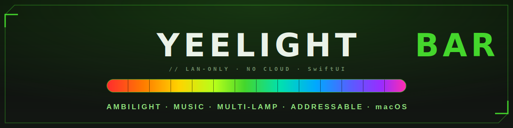

<p align="center">
  
</p>

<p align="center">
  
  
  
  
  
  
</p>

[English](README.md) · **Русский** · [中文](README.zh-CN.md) · [فارسی](README.fa.md) · [Español](README.es.md) · [العربية](README.ar.md)

Нативное приложение для macOS, управляющее устройствами **Yeelight** по локальной сети. Создано для **Yeelight Screen Light Bar Pro**
(`YLTD003`), но работает и с обычными RGB-лентами и лампами. Официальное ПО доступно только под Windows; это — аккуратная,
быстрая замена на SwiftUI с подсветкой по экрану (ambilight), реакцией на музыку и групповым управлением несколькими лампами.

> Никакого облака и аккаунтов. Всё происходит внутри вашей локальной сети.

## Возможности

- **Полное управление** — питание, передний белый свет (яркость + цветовая температура), фоновый RGB, готовые сцены.
- **Групповое / «смешанное» управление** — выберите несколько ламп и управляйте ими разом; каждая лампа говорит на своём
  диалекте протокола (у Screen Bar есть отдельный фоновый канал `bg`, у лент его нет).
- **Подсветка по экрану (ambilight)** — ScreenCaptureKit сэмплирует ваш экран и транслирует цвет в фоновый канал
  лампы с частотой ~20 Гц через UDP-сессию.
  - **Дисплей и область для каждой лампы**: при нескольких мониторах каждая лампа может сэмплировать *свой* дисплей и
    *свою* область на нём (верх / низ / лево / право / весь экран) — например, Screen Bar берёт верх основного экрана,
    а настольная лента под столом — низ другого.
  - Захват независим от разрешения (одинаково работает на 16:9, 4K, портретной ориентации и сверхшироких 32:9).
  - Живой предпросмотр: панель в форме экрана для каждого дисплея показывает, какую именно область сэмплирует каждая лампа, в её текущем цвете.
- **Реакция на музыку** — захватывает *системный* звук (без микрофона) и разбивает его на бас/середину/верх IIR-фильтрами.
  - Режим **Beat** пульсирует яркостью на удар бочки; режим **Spectrum** отображает бас→красный / середину→зелёный / верх→синий.
- **Два интерфейса** — компактная панель в строке меню для быстрых правок и полноценное окно с изменяемым размером (`NavigationSplitView`)
  для настройки.
- **Надёжность в реальной сети** — автообнаружение (SSDP + активное сканирование подсети), переподключение при смене IP по DHCP и
  сериализованное управление, чтобы лампа никогда не теряла команды при одновременных подключениях.

## Требования

- macOS 13 (Ventura) или новее, Apple Silicon или Intel.
- Устройство(а) Yeelight с включённым **LAN Control** (приложение Yeelight → устройство → *LAN Control*).
- Разрешение на **запись экрана** (System Settings → Privacy & Security) для режимов синхронизации с экраном и музыкой.

## Сборка и запуск

### Xcode
Откройте `YeelightBar.xcodeproj` и запустите схему **YeelightBar** (⌘R). Проект генерируется из `project.yml`
с помощью [XcodeGen](https://github.com/yonaskolb/XcodeGen); после правки спецификации выполните `xcodegen generate`.

### Swift Package Manager (без Xcode)
```sh
swift build
./scripts/bundle.sh          # собирает + подписывает build/YeelightBar.app
open build/YeelightBar.app
```
`scripts/setup-signing.sh` создаёт стабильную самоподписанную идентичность для подписи кода, чтобы разрешение на запись экрана
сохранялось между пересборками (ad-hoc-подпись меняется при каждой сборке и заново вызвала бы запрос разрешения).

## `yeectl` — инструмент командной строки

Небольшой CLI для тестирования и скриптинга протокола:

```sh
swift run yeectl discover                 # SSDP
swift run yeectl auto                      # SSDP, при неудаче — активное сканирование подсети
swift run yeectl state   <ip>
swift run yeectl on|off  <ip>
swift run yeectl bright  <ip> <0-100>
swift run yeectl ct      <ip> <1700-6500>
swift run yeectl rgb     <ip> <hex напр. FF8800>   # фоновый / bg-канал
swift run yeectl rainbow <ip> [seconds]           # тест потоковой передачи UDP 20 Гц
```

## Архитектура

```
Sources/
  YeelightKit/            # библиотека только для транспорта, без UI
    Yeelight.swift        # управление по TCP 55443 (JSON) + потоковая UDP-сессия 55444
    Discovery.swift       # обнаружение через multicast SSDP
    Scan.swift            # активное сканирование подсети + проверка IP, введённого вручную
  yeectl/                 # CLI
  YeelightBarApp/         # приложение SwiftUI
    LampController.swift   # @MainActor-хранилище: обнаружение, групповое управление, оркестрация синхронизации
    ScreenSyncEngine.swift # захват нескольких дисплеев → цвет по (дисплей, область) → раздача по UDP
    MusicSyncEngine.swift  # захват системного звука → beat/spectrum → раздача по UDP
    FullView.swift / MenuPanelView.swift
```

Протокол Yeelight LAN (управление по TCP, рукопожатие потоковой передачи UDP, своеобразные каналы `main_power`/`bg_power`
у Screen Bar) описан в [`PROTOCOL.md`](PROTOCOL.md).

## Заметки о Screen Light Bar Pro

У этой лампы два независимых канала — передний белый (`set_power` / `main_power`) и фоновый RGB
(`bg_set_power` / `bg_set_rgb`) — поэтому можно работать «только в фоновом режиме». Её свойство `power` ненадёжно (остаётся `on`,
даже когда передний свет выключен); вместо него приложение читает `main_power`. У обычных лент один канал, и они отвергают
команду `dev_toggle`, существующую только у Screen Bar, поэтому управление диспетчеризуется по типу устройства.

## Лицензия

[MIT](LICENSE) — приложение не связано с Yeelight / Xiaomi и не одобрено ими.
